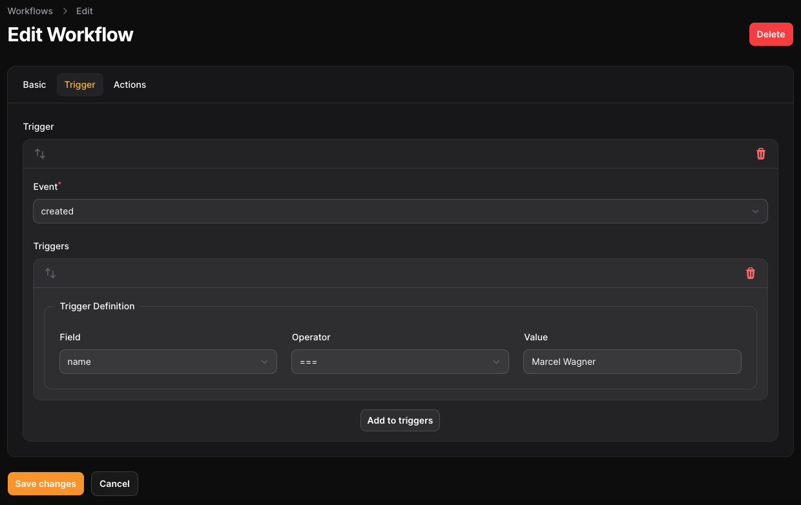
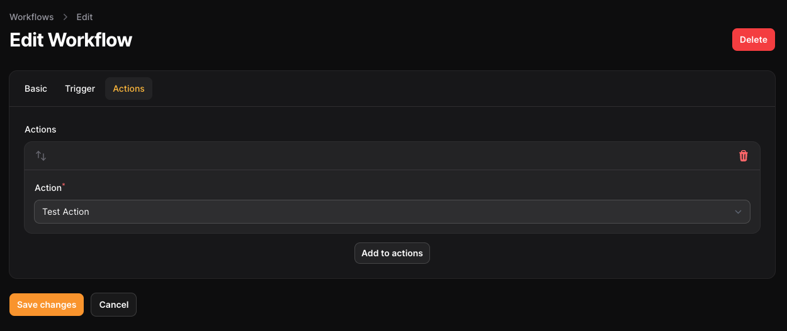

# Add workflows to your filament app

[](https://packagist.org/packages/tschucki/filament-workflows)
[](https://github.com/tschucki/filament-workflows/actions?query=workflow%3Arun-tests+branch%3Amain)
[](https://github.com/Tschucki/filament-workflows/actions/workflows/fix-php-code-styling.yml)
[](https://packagist.org/packages/tschucki/filament-workflows)

This plugin lets you add workflows to your filament app. You can attach triggers and dispatchable actions to your
workflows. The plugin will automatically execute the actions when the trigger conditions are met.

## Table of Contents

- [Images](#images)
- [Installation](#installation)
- [Usage](#usage)
    - [Basics](#basics)
    - [Add the trait to your model](#add-the-trait-to-your-model)
    - [Create an Action](#create-an-action)
- [Configuration](#configuration)
    - [Define searchable field](#define-searchable-field)
    - [Max Search Results](#max-search-results)
- [Testing](#testing)
- [Changelog](#changelog)
- [Contributing](#contributing)
- [Security Vulnerabilities](#security-vulnerabilities)
- [Credits](#credits)
- [License](#license)

## Images





## Installation

You can install the package via composer:

```bash
composer require tschucki/filament-workflows
```

You can install the plugin using:

```bash
php artisan filament-workflows:install
```

You can publish and run the migrations manually with:

```bash
php artisan vendor:publish --tag="filament-workflows-migrations"
php artisan migrate
```

Register the plugin in your `AdminPanelServiceProvider`:

```php
use Tschucki\FilamentWorkflows\FilamentWorkflowsPlugin;

->plugins([
    FilamentWorkflowsPlugin::make()
])
```

## Usage
### Basics
In order to let your models use workflows, you need to add the `InteractsWithWorkflows` trait to your model. By adding this trait, the plugin will automatically add a global observer to your model. So when ever a workflow matches the event and trigger conditions, the workflow will execute the actions.

### Add the trait to your model
```php
use Tschucki\FilamentWorkflows\Concerns\InteractsWithWorkflow;

class User extends Model {
  use InteractsWithWorkflow;
}
```

### Create an Action
In order to attach an action to your workflows, you will have to create a class within the `App\Jobs\Actions` folder. The class must extend the `BaseAction` class. This requires you to implement the `handle` method. This method will be called when the workflow is executed.

The action class is very similar to a job.
When ever the action get executed, the model will be passed to the `__construct` method. You can use the model to do whatever you want.

The plugin will find this class on its own. So you don't have to register it anywhere.

```php
<?php

namespace App\Jobs\WorkflowActions;

use App\Models\User;
use Illuminate\Database\Eloquent\Model;
use Tschucki\FilamentWorkflows\WorkflowActions\BaseAction;

class TestAction extends BaseAction
{
    public User $user;

    public function __construct(User $user)
    {
        $this->user = $user;
    }

    public function handle(): void
    {
        \Log::info($this->user->name . ' was created at ' . $this->user->created_at);
    }
    
    // Will be later used in the Logs (coming soon) 
    public function getActionName(): string
    {
        return 'Der Hackfleisch hassender Zerhacker';
    }

    public function getActionDescription(): string
    {
        return 'Schneidet Kopfsalat. Und das nachts :)';
    }

    public function getActionCategory(): string
    {
        return 'Default-Category';
    }

    public function getActionIcon(): string
    {
        return 'heroicon-o-adjustments';
    }
}
```

That's it. Now you can create and attach actions to your workflows.

## Configuration

### Define searchable field

If you don't just want to search for the `id`, you can use the function `getTitleColumnForWorkflowSearch` within your model to search in another field as well.

```php
    public function getTitleColumnForWorkflowSearch(): ?string
    {
        return 'name';
    }
```

### Max Search Results
In case you want to change the max search results for the models, you can publish the config file and change the `workflows.search.max_results` value (defaults to 100).
This can come in handy when you have a lot of models and the search is slow.

```php
<?php

return [
    'search' => [
        'max_results' => 100,
    ]
];
```

### Use Custom Models and Resources
If you want to use custom models and resources, you can publish the config file and change the `workflows.models` and `workflows.resources` values. It is highly recommended that custom models and resources extend the existing Workflow classes.

```php
<?php

return [
    'models' => [
        'workflow' => \Tschucki\FilamentWorkflows\Models\WorkflowLog::class,
        'workflow_log' => \Tschucki\FilamentWorkflows\Models\WorkflowLog::class,
    ],
    'resources' => [
        'workflow' => \Tschucki\FilamentWorkflows\Resources\FilamentWorkflowResource::class,
    ],
];
```

## Changelog

Please see [CHANGELOG](CHANGELOG.md) for more information on what has changed recently.

## Contributing

Please see [CONTRIBUTING](.github/CONTRIBUTING.md) for details.

## Security Vulnerabilities

Please review [our security policy](../../security/policy) on how to report security vulnerabilities.

## Credits

- [Marcel Wagner](https://github.com/Tschucki)
- [All Contributors](../../contributors)

## License

The MIT License (MIT). Please see [License File](LICENSE.md) for more information.
